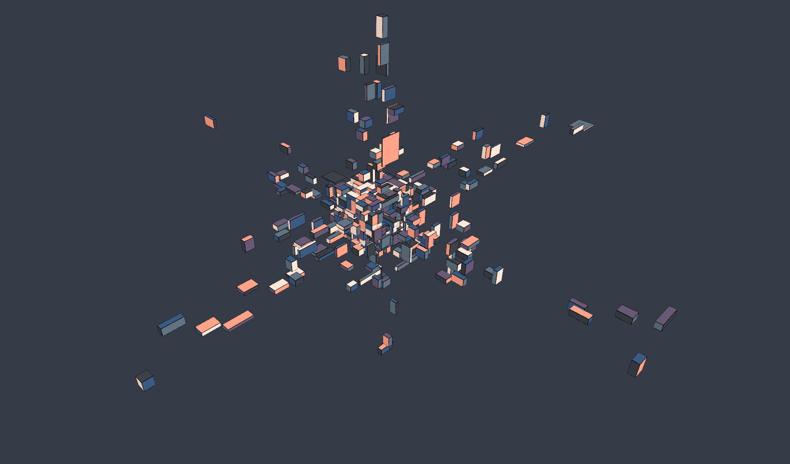

# Three.js Playground

A place where I test out ThreeJS Ideas.

Here is a repeated grid animation of different sized cubes.

Inspiration:
[Instagram Inspo: ylegall](https://www.instagram.com/p/DEd2S5AvMAi/)

I couldn't get the same amount they use, but close enough for learning.

Screenshot:


## Quick Start

```bash
npm install
npm run dev
```

Open http://localhost:5173/

## Build

```bash
npm run build
npm run preview
```
